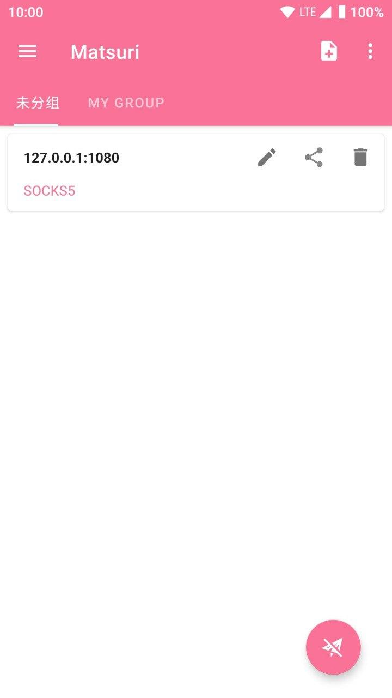
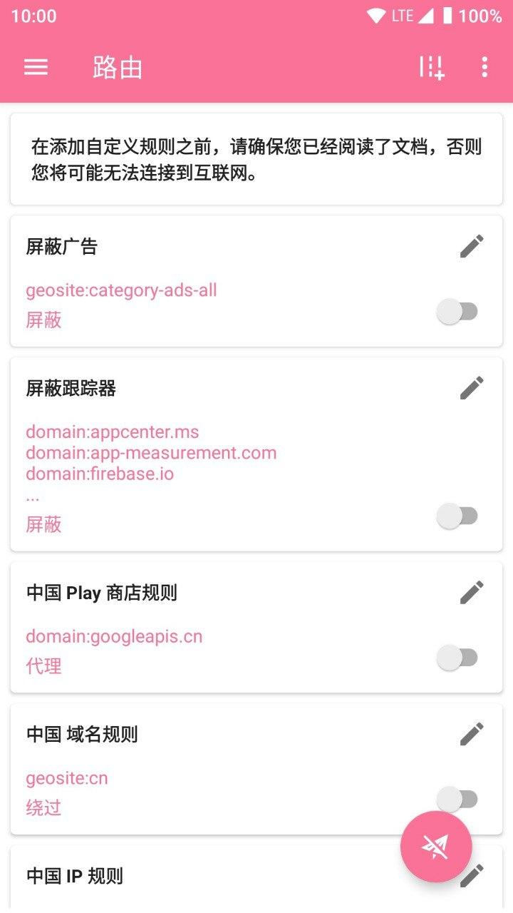
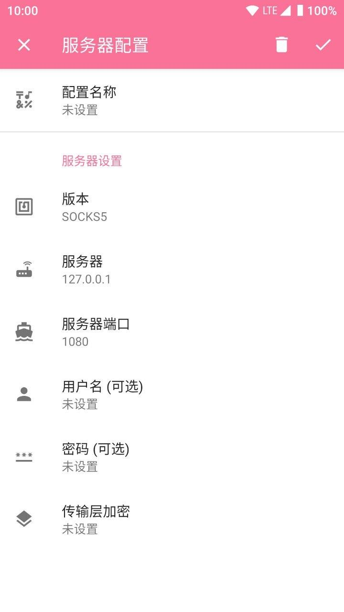
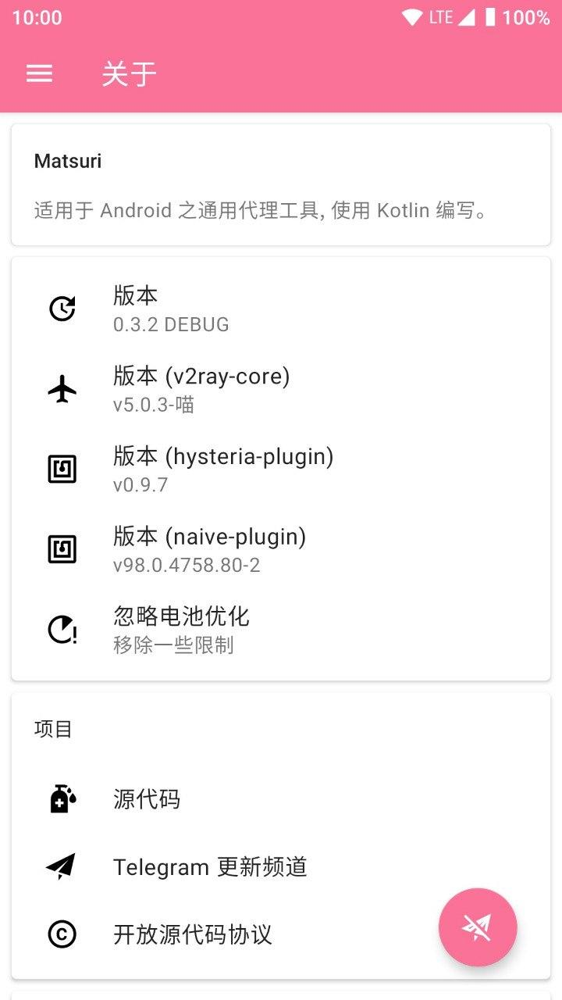

本文档有多页，如未看见目录，请点击左上角三条横线/

# Matsuri 茉莉（喵

适用于 Android 的代理工具链，用 Kotlin 编写。

这是 SagerNet 的一个分支，部分功能不同，改进了部分情况下的体验。支持高级插件。

[下载](/download/)

[配置](/m-configuration/)

# NekoRay （猫猫ray

基于 Qt/C++ 的跨平台代理配置管理器（ 使用 Matsuri 定制版 v2ray-core ）

[下载](/download/)

[配置](/n-configuration/)

## 更改记录和发布频道

[https://t.me/Matsuridayo](https://t.me/Matsuridayo)

## 赞助开发者

TRC20

TRhnA7SXE5Sap5gSG3ijxRmdYFiD4KRhPs

## 截图

